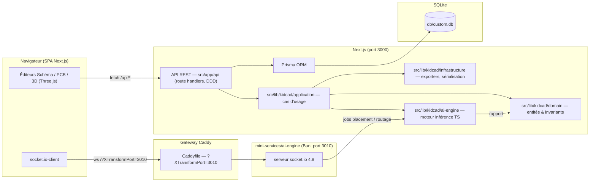
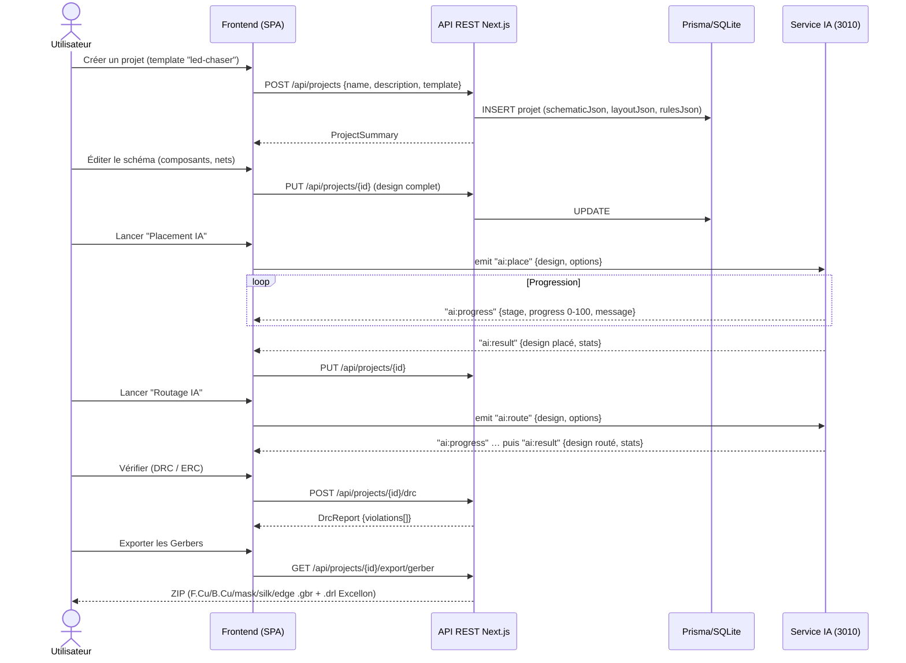

# Architecture — KidCAD-Pro-IA

> Dernière mise à jour : 2025. Vue d'ensemble technique de l'application.

## 1. Vue d'ensemble

KidCAD-Pro-IA est un **monolithe modulaire Next.js 16** (App Router, TypeScript) accompagné
d'un **mini-service IA socket.io** autonome (Bun, port 3010). La persistance est assurée par
**Prisma + SQLite** (`db/custom.db`). Le rendu 3D utilise **Three.js 0.185**.

Points clés :

- **Frontend → API REST** : CRUD projets, DRC/ERC, import/export (fetch JSON).
- **Frontend → Gateway Caddy → mini-service IA** : jobs temps réel
  (`ai:place`, `ai:route`, `ai:optimize`) avec progression (`ai:progress`) et résultat
  (`ai:result`). Le paramètre de requête `?XTransformPort=3010` indique à la gateway de
  router la connexion WebSocket vers le service IA (analogue d'un service gRPC).
- **Moteur IA TS** : déterministe, embarqué dans le processus (A\* maze-routing 2 couches,
  recuit simulé, rip-up & reroute, réduction de vias). Il produit les designs et les
  statistiques, et alimente les rapports DRC/ERC.
- **RL Python (`ai-engine/`)** : pipeline R&D hors-ligne (PPO + GNN, PyTorch). Il n'est
  **pas** requis à l'exécution (voir [ADR-002](./adr-002-moteur-ia.md)).

## 2. Architecture DDD

Le backend Next.js suit une organisation **Domain-Driven Design** sous `src/lib/kidcad/` :

| Couche | Chemin | Responsabilité |
|---|---|---|
| **Domaine** | `src/lib/kidcad/domain/` | Entités et invariants purs : `project` (agrégat racine), `schematic` (composants, nets, bornes), `layout` (pads, traces, vias, zones), `constraints` (règles DRC/ERC). Aucune dépendance framework. |
| **Application** | `src/lib/kidcad/application/` | Cas d'usage orchestration : `import` (netlist KiCad/JSON), `validate` (ERC), `place` (recuit simulé), `route` (A\* + rip-up & reroute), `optimize` (réduction de vias), `export` (Gerber/STEP/STL/BOM), `drc`, `erc`. |
| **Infrastructure** | `src/lib/kidcad/infrastructure/` + `src/app/api/` | Adaptateurs : accès Prisma, sérialisation JSON, générateurs Gerber RS-274X / Excellon / STEP AP214 / STL / CSV, route handlers REST. |
| **Pkg** | `src/lib/kidcad/pkg/` | Utilitaires transverses : `geometry` (distance, intersection, AABB), `logger`, `utils`. |
| **Shared** | `src/lib/kidcad/shared/types.ts` | Types TypeScript partagés client/serveur (contrat d'échange unique, voir [ADR-003](./adr-003-formats-echanges.md)). |
| **Library** | `src/lib/kidcad/library/` | Bibliothèques d'empreintes (0805, DIP-8, DIP-16…) et de symboles. |

Le **mini-service IA** (`mini-services/ai-engine/`) est un service socket.io **Bun** autonome
qui réutilise le même moteur TS : il joue le rôle du service gRPC prévu initialement.

## 3. Flux utilisateur complet

## 4. Mapping arborescence d'origine → implémentation

Le projet d'origine spécifiait un backend Go et un service IA gRPC. Le tableau suivant
documente la correspondance exacte, dossier par dossier :

| Chemin d'origine (spécifié) | Chemin réel (implémentation) | Rôle |
|---|---|---|
| `backend/internal/domain` | `src/lib/kidcad/domain/` | Entités : `project`, `schematic`, `layout`, `constraints` |
| `backend/internal/application` | `src/lib/kidcad/application/` | Cas d'usage : import, validate, place, route, optimize, export, drc, erc |
| `backend/internal/infrastructure` | `src/lib/kidcad/infrastructure/` | Adaptateurs persistance/exports |
| `backend/internal/pkg` | `src/lib/kidcad/pkg/` | Utilitaires : `geometry`, `logger`, `utils` |
| `backend/internal/server` (handlers HTTP) | `src/app/api/` (route handlers Next.js) | API REST `/api/projects`, `/api/footprints`, `/api/health` |
| `frontend/` (SPA séparée) | `src/app/page.tsx` + `src/components/kidcad/` | UI mono-page (imposée par la sandbox) |
| `proto/` + service gRPC | `src/lib/kidcad/shared/types.ts` + socket.io | Contrat d'échange JSON typé (voir ADR-003) |
| `ai-engine/` (gRPC serveur Python) | `mini-services/ai-engine/` (socket.io Bun :3010) | Service IA temps réel |
| `ai-engine/` (entraînement RL) | `ai-engine/` (racine, Python/PyTorch) | R&D : `pcb_env`, PPO, GNN, benchmark |
| `deploy/` | `docker/` + `configs/` + `Caddyfile` | Conteneurisation, reverse proxy, configuration |
| `docs/` | `docs/` | Architecture, ADR, API (OpenAPI), guides |
| `scripts/` | `scripts/` | `setup-dev.sh`, `build-all.sh`, `generate-models.sh` |

**Pourquoi ce mapping ?** L'environnement cible est un monorepo web temps réel : un seul
langage (TypeScript) de la base de données au canvas, des types partagés entre client et
serveur, un déploiement unique, et un mini-service socket.io qui remplace proprement le
gRPC pour le streaming de progression des jobs IA. Voir
[ADR-001](./adr-001-monorepo-nextjs.md) et [ADR-002](./adr-002-moteur-ia.md).

## 5. API REST et temps réel

- Spécification complète : [`docs/api/openapi.yaml`](../api/openapi.yaml)
- Endpoints : `/api/projects`, `/api/projects/{id}`, `/api/projects/{id}/drc`,
  `/api/projects/{id}/erc`, `/api/projects/{id}/import`,
  `/api/projects/{id}/export/{format}` (gerber, bom, step, stl, json, netlist-kicad),
  `/api/footprints`, `/api/health`.
- socket.io (via gateway `?XTransformPort=3010`) :
  - client → serveur : `ai:place {design, options}`, `ai:route {design, options}`, `ai:optimize`
  - serveur → client : `ai:progress {stage, progress, message}`, `ai:result {design, stats}`, `ai:error`

## 6. Règles DRC par défaut

| Paramètre | Valeur |
|---|---|
| Largeur de piste min | 0.25 mm |
| Isolation (clearance) min | 0.2 mm |
| Perçage de via min | 0.35 mm |
| Diamètre de via min | 0.7 mm |
| Distance au bord de carte | 0.3 mm |
| Grille de routage | 0.635 mm (25 mil) |
