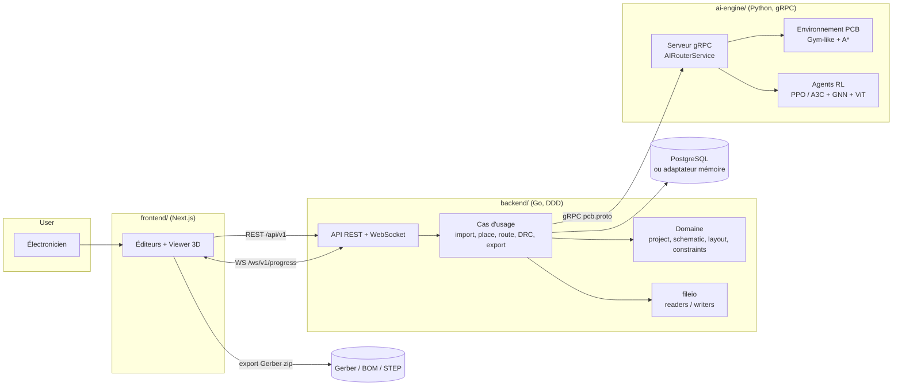

# KidCAD-Pro-IA — Monorepo


[](https://github.com/assihervey-coder/IA-PCB/releases/tag/v0.1.0)

**KidCAD-Pro-IA** est un logiciel de CAO électronique (EDA) piloté par l'IA : de la
netlist au dossier de fabrication. Architecture hexagonale (ports & adaptateurs)
et Domain-Driven Design, en trois modules découplés :

- **backend/** (Go) — cœur métier DDD : projets, schémas, placement/routage,
  règles de conception (DRC), import multi-formats (KiCad, Eagle, interchange,
  netlists), exports industriels (Gerber RS-274X, BOM, STEP), API REST +
  WebSocket temps réel.
- **ai-engine/** (Python) — microservice gRPC d'intelligence artificielle :
  placement par recuit simulé ou modèle RL, routage automatique
  (PPO / A3C avec repli A\* intégré), optimisation post-routage.
- **frontend/** (Next.js/TypeScript) — éditeur de schéma (SVG), éditeur de
  layout (Canvas 2D), visualiseur 3D (Three.js), suivi du routage IA en temps
  réel, centre d'export.

Le contrat d'interface complet (REST, WebSocket, gRPC, signatures Go) est figé
dans [`docs/architecture/contracts.md`](docs/architecture/contracts.md).

---

## Architecture



## Structure du dépôt

```text
kidcad-pro-ia/
├── backend/                      # Cœur métier Go (DDD)
│   ├── cmd/kidcad-server/        # Point d'entrée du serveur
│   ├── internal/
│   │   ├── domain/               # Entités pures : project, schematic, layout, constraints
│   │   ├── application/          # Cas d'usage : import, place, route, optimize, export, drc, erc
│   │   ├── infrastructure/       # Adaptateurs : persistence (SQL/mémoire), fileio, API, IA, config
│   │   └── pkg/                  # logger, geometry, utils
│   └── pkg/pcb-format/           # Format d'échange .kidcad.json (public)
├── ai-engine/                    # Microservice IA Python (gRPC)
│   ├── cmd/ai-server/            # Point d'entrée du serveur gRPC
│   ├── src/                      # environment (Gym-like), agents (PPO/A3C), models (GNN/ViT), service
│   ├── training/                 # Configs d'entraînement + tokenizer
│   ├── data/                     # Datasets (raw / processed / augmentations)
│   └── evaluation/               # bench.py + metrics.py
├── frontend/                     # Interface Next.js
│   ├── public/demo/              # Jeu de données mode démo (backend injoignable)
│   └── src/
│       ├── app/layout/           # AppShell, Header, Sidebar
│       ├── app/pages/            # project-manager, schematic-editor, pcb-layout (+ viewer, router), export
│       ├── app/components/       # UI kit : buttons, modals, forms
│       ├── lib/                  # api (REST/WS), store (Zustand), utils
│       └── styles/               # SCSS global + variables
├── shared/                       # pcb.proto (contrat gRPC), pcb.d.ts, schemas JSON, stubs générés
├── tests/                        # e2e (Playwright), intégration (Go), fixtures
├── docker/                       # Dockerfile, Dockerfile.frontend, docker-compose.yml
├── scripts/                      # setup-dev.sh, build-all.sh, generate-models.sh
├── configs/                      # production/ (nginx, appsettings) + development/
├── docs/                         # api/ (OpenAPI), guides/, architecture/ (contrats, ADR)
└── Makefile                      # cibles : deps, proto, build, run-*, test, docker-*, models
```

## Démarrage rapide

Prérequis : Go 1.22+, Python 3.10+, Node 18.17+, `protoc`-tools (via pip).

```bash
# 1. Dépendances
make deps

# 2. Stubs gRPC (commités, à régénérer après modification de pcb.proto)
make proto

# 3a. Stack complète via Docker
make docker-up            # http://localhost:3000

# 3b. ... ou en mode développement (3 terminaux)
make run-ai               # moteur IA gRPC sur :50051
make run-backend          # API Go sur :8080
make run-frontend         # Next.js sur :3000
```

> Le backend démarre **même sans PostgreSQL** (adaptateur mémoire) et **même sans
> moteur IA** (les routes IA répondent `ai_unreachable`). Le frontend affiche un
> **mode démo** autonome si l'API est injoignable.

### Démo en 30 secondes : la carte cauchemar 🧟

```bash
# 1. Générer une carte volontairement mauvaise (fautes réelles) :
curl -s -X POST http://localhost:8080/api/v1/demo/nightmare | jq

# 2. Le Design Doctor rend un verdict sévère (score ~55, grade D) :
curl -s http://localhost:8080/api/v1/projects/<id>/doctor | jq '.score,.grade'

# 3. L'Auto-Healer DRC répare en un appel (largeurs, vias, bord) :
curl -s -X POST http://localhost:8080/api/v1/projects/<id>/drc/autofix | jq

# 4. Compléter le routage puis admirer la remontée du score :
curl -s -X POST http://localhost:8080/api/v1/projects/<id>/route -d '{"strategy":"astar"}'
curl -s http://localhost:8080/api/v1/projects/<id>/doctor | jq '.score,.grade'
```

`GET /healthz` signale l'état du moteur RL : `ai_engine` (`ok`/`unreachable`),
`ai_device` (`cpu`/`cuda`) et `ai_model_loaded` (`true` quand un checkpoint
entraîné est chargé).

## Variables d'environnement du backend

| Variable | Défaut | Rôle |
|---|---|---|
| `KIDCAD_HTTP_PORT` | `8080` | port HTTP/WS |
| `KIDCAD_DB_URL` | *(vide)* | DSN PostgreSQL ; vide = adaptateur mémoire |
| `KIDCAD_AI_ADDR` | `localhost:50051` | adresse du microservice IA |
| `KIDCAD_LOG_LEVEL` | `info` | debug/info/warn/error |
| `KIDCAD_DATA_DIR` | `./data` | répertoire des exports |
| `KIDCAD_ALLOWED_ORIGINS` | `*` | CORS |
| `KIDCAD_CONFIG` | *(vide)* | fichier JSON de configuration optionnel |

## L'IA dans KidCAD

| Fonction | Stratégies | Détaillé |
|---|---|---|
| Placement | `heuristic`, `rl` | recuit simulé (HPWL + anti-chevauchement) ou modèle RL (GNN) |
| Routage | `astar`, `rl` | A\* maze-routing multi-couches (repli intégré, toujours disponible) ou agent PPO/A3C entraîné |
| Optimisation | — | rip-up & reroute des pires nets, réduction de vias |

L'entraînement RL (PyTorch) est un pipeline optionnel : voir
`ai-engine/README.md`, `ai-engine/training/` et `scripts/generate-models.sh`.
L'inférence ne requiert **jamais** torch.

```bash
# Entraîner le routeur PPO (torch requis, cf. ai-engine/training/router/README.md) :
make train-router STEPS=200000
# → training/router/model_v1.pt ; redémarrez le moteur IA :
#   GET /healthz renvoie alors "ai_model_loaded": true
#   et POST .../route {"strategy":"rl"} utilise le modèle (repli A* sinon).
```

## Tests

```bash
make test-backend         # go test ./... (unitaires + intégration)
make test-ai              # pytest ai-engine
make test-frontend        # Playwright E2E (tests/e2e)
```

## Magic Pack ✨

Cinq fonctions d'intelligence embarquée, testées et déterministes :

| Fonction | Endpoint | Description |
|---|---|---|
| 🔮 Magic Copilot | `POST .../magic` | langage naturel FR/EN → actions PCB (« place R1 près de U3 », « largeur 12 mil ») |
| 🌡️ Thermal Ghost | `POST .../thermal` | carte thermique stationnaire (Gauss-Seidel), hotspots classés, what-if |
| 📡 Eye Oracle | `POST .../si` | impédance Z0, délai, budget de réflexion, ouverture d'œil estimée à 1 Gbps |
| ⚔️ AI Arena | `POST .../arena` | duel de routeurs greedy vs A*, récit WebSocket, classement ELO |
| 🧬 EvoPlace | ai-engine | placement génétique (HPWL + pénalité de recouvrement), streaming par génération |

Côté frontend : palette **⌘K** (MagicBar) avec aperçu des actions, exécution
sur Entrée, dictée vocale 🎙 et raccourcis 🌡️/📡/⚔️. Détails : [`docs/guides/guide-magic-pack.md`](docs/guides/guide-magic-pack.md)
et ADR-004.

## Pack WOW 🔥

Les fonctions qui surprennent les experts, plus les good/best to have —
testées et documentées dans [`docs/guides/guide-pack-wow.md`](docs/guides/guide-pack-wow.md) :

| Fonction | Endpoint | Description |
|---|---|---|
| 🩹 DRC Auto-Healer | `POST .../drc/autofix` | répare largeurs, vias et marges de bord avec confiance + delta DRC avant/après (dry-run possible) |
| 🩺 Design Doctor | `GET .../doctor` | audit global noté /100, grade A+→D, radar 5 axes, ordonnances priorisées chiffrées |
| 💰 Oracle DFM | `POST .../dfm` | prix unitaire à 3 volumes, surtaxes détaillées, rendement premier passage, conseils |
| 🕰 Time Machine | `POST/GET .../snapshots` | instantanés, diff structurel lisible, restauration réversible |
| 📊 Stats live | `GET .../stats` | occupation, cuivre par couche, top nets, classes |
| 👥 Présence live | `/ws/v1/progress` | curseurs collaborateurs temps réel + avatars (extension additive du hub) |
| ↶ Undo/Redo | frontend | Ctrl+Z / Ctrl+Maj+Z sur toutes les mutations historisées |
| ⌨️ Raccourcis | frontend | aide-mémoire « ? » |
| 🎙 Voix | frontend | dictée des commandes copilot (Web Speech API, fr-FR) |

## Extensions v0.2 — multi-couches, plans de masse, classes de nets, collaboration

| Fonction | Endpoint | Description |
|---|---|---|
| 🗺️ Routage multi-couches | `POST .../route` | A* et RL opèrent sur **N couches** (1–34) : le moteur IA reçoit `layer_count`/`layer_names` et insère les vias de changement de couche lui-même |
| 🟩 Plans de masse (copper pours) | `POST .../pours` | génération/re-fill de plans GND par couche, remplissage par échantillonnage respectant les clearances, **couture de vias** en quinconce, persistance interchange/SQL/REST |
| 🏷️ Classes de nets | `GET/PUT .../netclasses` | classement des nets (`power`, `high-speed`…), règles par classe (largeur, isolation, via, perçage) transmises au moteur IA ; `POST .../route {"nets":[...]}` pour router une sélection |
| 👥 Collaboration CRDT | `POST/GET .../collab/*` | édition multi-utilisateurs (registres LWW + horloges de Lamport), diffusion WebSocket `type:"collab"`, **undo/redo par acteur persistant** (journal JSONL rejoué au redémarrage) |
| 🩺 Doctor ↔ moteur RL | `GET .../doctor` | axe `ai` (device, `model_loaded`) + **répétition sandbox** : prédiction chiffrée du routage des nets manquants par le moteur RL, sans rien appliquer |

Guide pas-à-pas : [`docs/guides/guide-avances.md`](docs/guides/guide-avances.md) —
détail des contrats additifs : [`docs/architecture/contracts.md` §11](docs/architecture/contracts.md).

## Documentation

- [`docs/architecture/contracts.md`](docs/architecture/contracts.md) — contrats d'interface (source de vérité)
- [`docs/architecture/architecture.md`](docs/architecture/architecture.md) — vues d'architecture et décisions
- [`docs/api/openapi.yaml`](docs/api/openapi.yaml) — spécification OpenAPI 3
- [`docs/guides/guide-demarrage-rapide.md`](docs/guides/guide-demarrage-rapide.md) — tutoriel
- [`docs/guides/guide-utilisateur.md`](docs/guides/guide-utilisateur.md) — manuel utilisateur
- [`docs/guides/guide-avances.md`](docs/guides/guide-avances.md) — plans de masse, classes de nets, CRDT, démo cauchemar

## Licence

AGPL-3.0 — voir [LICENSE](LICENSE).
