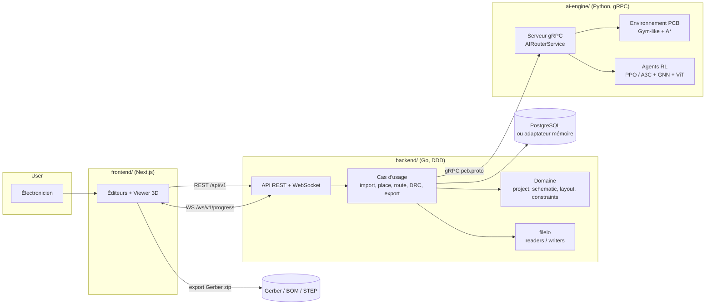

# KidCAD-Pro-IA — Monorepo


**KidCAD-Pro-IA** est un logiciel de CAO électronique (EDA) piloté par l'IA : de la
netlist au dossier de fabrication. Architecture hexagonale (ports & adaptateurs)
et Domain-Driven Design, en trois modules découplés :

- **backend/** (Go) — cœur métier DDD : projets, schémas, placement/routage,
  règles de conception (DRC), import multi-formats (KiCad, Eagle, interchange,
  netlists), exports industriels (Gerber RS-274X, BOM, STEP), API REST +
  WebSocket temps réel.
- **ai-engine/** (Python) — microservice gRPC d'intelligence artificielle :
  placement par recuit simulé ou modèle RL, routage automatique
  (PPO / A3C avec repli A\* intégré), optimisation post-routage.
- **frontend/** (Next.js/TypeScript) — éditeur de schéma (SVG), éditeur de
  layout (Canvas 2D), visualiseur 3D (Three.js), suivi du routage IA en temps
  réel, centre d'export.

Le contrat d'interface complet (REST, WebSocket, gRPC, signatures Go) est figé
dans [`docs/architecture/contracts.md`](docs/architecture/contracts.md).

---

## Architecture



## Structure du dépôt

```text
kidcad-pro-ia/
├── backend/                      # Cœur métier Go (DDD)
│   ├── cmd/kidcad-server/        # Point d'entrée du serveur
│   ├── internal/
│   │   ├── domain/               # Entités pures : project, schematic, layout, constraints
│   │   ├── application/          # Cas d'usage : import, place, route, optimize, export, drc, erc
│   │   ├── infrastructure/       # Adaptateurs : persistence (SQL/mémoire), fileio, API, IA, config
│   │   └── pkg/                  # logger, geometry, utils
│   └── pkg/pcb-format/           # Format d'échange .kidcad.json (public)
├── ai-engine/                    # Microservice IA Python (gRPC)
│   ├── cmd/ai-server/            # Point d'entrée du serveur gRPC
│   ├── src/                      # environment (Gym-like), agents (PPO/A3C), models (GNN/ViT), service
│   ├── training/                 # Configs d'entraînement + tokenizer
│   ├── data/                     # Datasets (raw / processed / augmentations)
│   └── evaluation/               # bench.py + metrics.py
├── frontend/                     # Interface Next.js
│   ├── public/demo/              # Jeu de données mode démo (backend injoignable)
│   └── src/
│       ├── app/layout/           # AppShell, Header, Sidebar
│       ├── app/pages/            # project-manager, schematic-editor, pcb-layout (+ viewer, router), export
│       ├── app/components/       # UI kit : buttons, modals, forms
│       ├── lib/                  # api (REST/WS), store (Zustand), utils
│       └── styles/               # SCSS global + variables
├── shared/                       # pcb.proto (contrat gRPC), pcb.d.ts, schemas JSON, stubs générés
├── tests/                        # e2e (Playwright), intégration (Go), fixtures
├── docker/                       # Dockerfile, Dockerfile.frontend, docker-compose.yml
├── scripts/                      # setup-dev.sh, build-all.sh, generate-models.sh
├── configs/                      # production/ (nginx, appsettings) + development/
├── docs/                         # api/ (OpenAPI), guides/, architecture/ (contrats, ADR)
└── Makefile                      # cibles : deps, proto, build, run-*, test, docker-*, models
```

## Démarrage rapide

Prérequis : Go 1.22+, Python 3.10+, Node 18.17+, `protoc`-tools (via pip).

```bash
# 1. Dépendances
make deps

# 2. Stubs gRPC (commités, à régénérer après modification de pcb.proto)
make proto

# 3a. Stack complète via Docker
make docker-up            # http://localhost:3000

# 3b. ... ou en mode développement (3 terminaux)
make run-ai               # moteur IA gRPC sur :50051
make run-backend          # API Go sur :8080
make run-frontend         # Next.js sur :3000
```

> Le backend démarre **même sans PostgreSQL** (adaptateur mémoire) et **même sans
> moteur IA** (les routes IA répondent `ai_unreachable`). Le frontend affiche un
> **mode démo** autonome si l'API est injoignable.

## Variables d'environnement du backend

| Variable | Défaut | Rôle |
|---|---|---|
| `KIDCAD_HTTP_PORT` | `8080` | port HTTP/WS |
| `KIDCAD_DB_URL` | *(vide)* | DSN PostgreSQL ; vide = adaptateur mémoire |
| `KIDCAD_AI_ADDR` | `localhost:50051` | adresse du microservice IA |
| `KIDCAD_LOG_LEVEL` | `info` | debug/info/warn/error |
| `KIDCAD_DATA_DIR` | `./data` | répertoire des exports |
| `KIDCAD_ALLOWED_ORIGINS` | `*` | CORS |
| `KIDCAD_CONFIG` | *(vide)* | fichier JSON de configuration optionnel |

## L'IA dans KidCAD

| Fonction | Stratégies | Détaillé |
|---|---|---|
| Placement | `heuristic`, `rl` | recuit simulé (HPWL + anti-chevauchement) ou modèle RL (GNN) |
| Routage | `astar`, `rl` | A\* maze-routing multi-couches (repli intégré, toujours disponible) ou agent PPO/A3C entraîné |
| Optimisation | — | rip-up & reroute des pires nets, réduction de vias |

L'entraînement RL (PyTorch) est un pipeline optionnel : voir
`ai-engine/README.md`, `ai-engine/training/` et `scripts/generate-models.sh`.
L'inférence ne requiert **jamais** torch.

## Tests

```bash
make test-backend         # go test ./... (unitaires + intégration)
make test-ai              # pytest ai-engine
make test-frontend        # Playwright E2E (tests/e2e)
```

## Documentation

- [`docs/architecture/contracts.md`](docs/architecture/contracts.md) — contrats d'interface (source de vérité)
- [`docs/architecture/architecture.md`](docs/architecture/architecture.md) — vues d'architecture et décisions
- [`docs/api/openapi.yaml`](docs/api/openapi.yaml) — spécification OpenAPI 3
- [`docs/guides/guide-demarrage-rapide.md`](docs/guides/guide-demarrage-rapide.md) — tutoriel
- [`docs/guides/guide-utilisateur.md`](docs/guides/guide-utilisateur.md) — manuel utilisateur

## Licence

AGPL-3.0 — voir [LICENSE](LICENSE).
