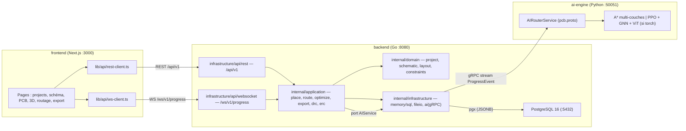
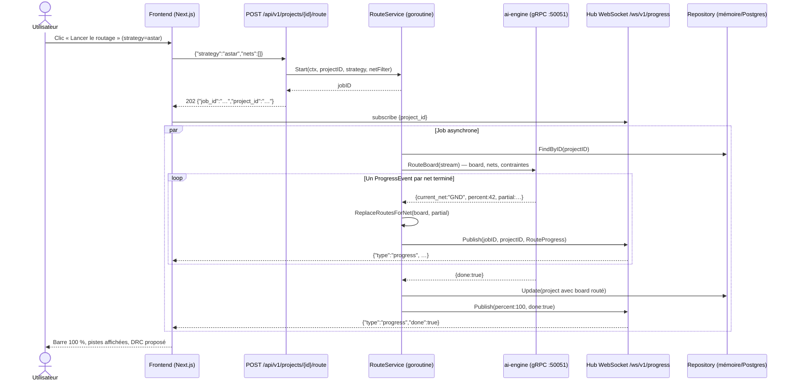
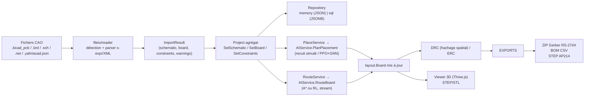

# Architecture — YahriaCad (monorepo)

> Dernière mise à jour : 2025. Vue technique du monorepo cible :
> backend Go DDD, moteur IA Python/gRPC, frontend Next.js.
> Source de vérité des contrats : [`contracts.md`](./contracts.md).

## 1. Vue d'ensemble

YahriaCad est une application de CAO électronique découpée en **trois
modules** communiquant par contrats typés :

| Module | Stack | Rôle |
|---|---|---|
| `frontend/` | Next.js 14 (App Router), TypeScript strict, SCSS, Zustand, Three.js | Interface utilisateur : projets, schéma, PCB 2D, 3D, routage, exports |
| `backend/` | Go 1.22, `net/http`, `gorilla/websocket`, `pgx/v5`, `log/slog` | API REST `/api/v1`, WebSocket `/ws/v1/progress`, cas d'usage métier, persistance |
| `ai-engine/` | Python 3.11, gRPC, (torch optionnel) | Placement et routage automatiques, progression streaming |
| `shared/` | protobuf + TypeScript + JSON Schema | Contrats uniques : `pcb.proto`, `pcb.d.ts`, schémas d'échange |

Points clés :

- **Backend autonome** : il démarre sans moteur IA (routes IA en
  `ai_unreachable`) et sans PostgreSQL (adaptateur mémoire).
- **Temps réel** : les jobs IA publient leur progression via un flux gRPC
  re-publié en WebSocket côté frontend.
- **Contrats figés** : `contracts.md` + `shared/` sont la seule référence
  inter-modules ; aucun stub dupliqué.

## 2. Principes : architecture hexagonale (ports & adaptateurs) + DDD

Le backend suit le patron **hexagonal** : le domaine au centre, les cas
d'usage autour, les adaptateurs en périphérie. Dépendances autorisées :
`infrastructure → application → domain → pkg`. Interdiction :
`domain → application/infrastructure`.

| Couche | Chemin | Contenu |
|---|---|---|
| **Domaine** | `backend/internal/domain/` | Agrégats purs : `project` (racine), `schematic` (composants, nets), `layout` (board, empreintes, pistes, vias), `constraints` (règles). Zéro dépendance externe. |
| **Application** | `backend/internal/application/` | Cas d'usage : `schematic` (import/validation), `layout` (place/route/optimize), `export` (Gerber/BOM/STEP), `verification` (DRC/ERC). Déclare les **ports** (`AIService`, `ProgressPublisher`, `Repository`). |
| **Infrastructure** | `backend/internal/infrastructure/` | Adaptateurs : `persistence/memory`, `persistence/sql`, `fileio/reader` (KiCad, Eagle, échange natif), `fileio/writer` (Gerber, STEP), `ai` (client gRPC), `api/rest`, `api/websocket`, `config`. |
| **Pkg** | `backend/internal/pkg/` | Transverse : `logger` (slog JSON), `geometry` (AABB, intersections), `utils`. |
| **Format** | `backend/pkg/pcb-format/` | Sérialisation schéma/layout/constraints ↔ JSON (partagé mémoire/SQL). |

Les ports sont définis dans la couche application et implémentés en
périphérie — signatures exactes dans [`contracts.md` §4-5](./contracts.md).
Voir [ADR-001](./adr/adr-001-architecture-hexagonale.md).

## 3. Séquence : routage IA de bout en bout

Le job vit dans un `JobRegistry` partagé (route + optimize) ; le sondage REST
`GET /jobs/{jobID}` est le recours si le WebSocket est coupé.

## 4. Modules et responsabilités

| Module | Fichiers clés | Responsabilité |
|---|---|---|
| `domain/project` | `entity.go`, `repository.go` | Agrégat Project (métadonnées, couches), port `Repository` |
| `domain/schematic` | `component.go`, `net.go`, `schematic.go` | Composants, nets, connexions, primitives ERC |
| `domain/layout` | `layout.go`, `footprint.go`, `track.go`, `via.go` | Board, empreintes, pistes, vias, `ReplaceRoutesForNet` |
| `domain/constraints` | `rule.go`, `constraint_set.go` | Règles de conception (clearance, largeur, vias, bord) |
| `application/schematic` | `import.go`, `validate.go` | Import multi-formats, validation (ERC) |
| `application/layout` | `place.go`, `route.go`, `optimize.go` | Ports `AIService`/`ProgressPublisher`, `JobRegistry`, goroutines |
| `application/export` | `gerber.go`, `bom.go`, `step.go` | Gerber ZIP, BOM CSV, STEP |
| `application/verification` | `drc.go`, `erc.go` | DRC (hachage spatial), ERC |
| `infrastructure/persistence` | `memory/`, `sql/` + migrations | Mémoire (dev) ou PostgreSQL/JSONB (prod) |
| `infrastructure/fileio` | `reader/`, `writer/` | Lecteurs KiCad/Eagle/natif, écrivains Gerber RS-274X / STEP AP214 |
| `infrastructure/ai` | `grpc_client.go` | Client gRPC vers ai-engine, implémente le port `AIService` |
| `infrastructure/api` | `rest/router.go`, `websocket/progress.go` | HTTP `/api/v1`, hub WS avec ping 30 s et filtrage par projet |
| `ai-engine/cmd/ai-server` | `main.py` | Serveur gRPC (ThreadPoolExecutor 8 workers), arrêt propre |
| `ai-engine/src` | `service.py`, `environment/`, `agents/`, `models/` | Servicer gRPC, environnement de routage, PPO/A3C, GNN, ViT |
| `shared/gen` | `go/`, `python/` | Stubs générés (protoc), jamais édités à la main |

## 5. Flux de données : de l'import à l'export

Étapes :

1. **Import** — le lecteur détecte le format (extension + contenu), parse le
   subset KiCad s-expression (§7 des contrats) ou le XML Eagle, produit un
   `ImportResult` complet (schéma + board + contraintes + avertissements).
2. **Stockage** — l'agrégat est persisté (JSON en mémoire, JSONB en SQL) ;
   les évolutions passent par `PUT /layout` ou les jobs IA.
3. **Enrichissement IA** — placement (HPWL minimal) puis routage (nets →
   pistes + vias), chaque résultat appliqué via `ReplaceRoutesForNet`.
4. **Vérification** — DRC/ERC sur le design courant, violations listées avec
   codes normalisés (`DRC_*`, `ERC_*`).
5. **Export** — Gerber par couche (fichiers suffixés `-F_Cu.gbr`, …),
   BOM groupée, STEP pour la mécanique.

## 6. Décision de repli A*

Le moteur IA reste **facultatif à l'exécution** :

- `ai-engine` importe torch **paresseusement** (dans les fonctions RL) : le
  service gRPC démarre et routé avec **A\* multi-couches** pur Python si
  torch ou les checkpoints `.pt` sont absents.
- Le backend traite l'IA comme un port : `Health` au démarrage (warning +
  `ai_engine: unreachable`), réponses `ai_unreachable` (HTTP 502) si le
  service est injoignable — le reste de l'application (projets, imports,
  DRC/ERC, exports) reste pleinement fonctionnel.
- Stratégies exposées : `astar` (déterministe, par défaut), `rl` (modèle
  entraîné), `heuristic`/recuit simulé pour le placement. Le client choisit,
  le moteur dégrade proprement.

Voir [ADR-002](./adr/adr-002-moteur-ia-grpc.md) et
[ADR-003](./adr/adr-003-routage-rl.md).

## 7. Journal des décisions d'architecture (ADR)

| ADR | Titre | Statut |
|---|---|---|
| [ADR-001](./adr/adr-001-architecture-hexagonale.md) | Architecture hexagonale (DDD, ports & adaptateurs) pour le backend Go | Accepté |
| [ADR-002](./adr/adr-002-moteur-ia-grpc.md) | Moteur IA en microservice Python séparé, contrat gRPC `pcb.proto` | Accepté |
| [ADR-003](./adr/adr-003-routage-rl.md) | Routage par apprentissage par renforcement (PPO/A3C) avec repli A* | Accepté |
